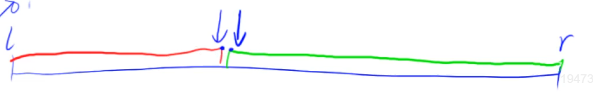

[toc]


# 1. 基础算法

# 1.1 二分

### 二分的本质

- 有单调性一定可以二分，没有单调性也可以二分。
- 二分的本质是一个区间内，区间A满足某个性质，区间B不满足某个性质，通过二分可以找到两个区间的边界。

### 二分的模板

- 搜索红色区域的边界，更新mid需要+1；（即l=mid需要加1，r=mid不需要加1）

> **为什么l=mid时，更新mid要+1。注意除法是向下取整**
>
> 1. 若不加1，在区间[l, r]中更新，且l=r-1，check(mid)==true。则(l + r)/2=l，下一个更新区间仍为[l, r]，出现死循环。
> 2. 若加1，在区间[l, r]中更新，且l=r-1, check(mid)==true。则(l + r + 1)/2=r, 下一个更新区间变成[r, r]，跳出了循环。



```java
public boolean check(int mid){/*检查mid位置的值是否满足某种性质*/}
//第一个二分为搜索满足红色区域的边界点
public void binarySearch(int left, int right){
    //特别注意这里需要+1
    int mid = (right - left + 1) / 2 + left;
    if(check(mid)){ 
        //mid的值满足红色区域，则更新为[mid, r]去搜索
        l = mid;
    }else{
        //mid的值不满足红色区域，则更新为[l, mid-1]去搜索
        r = mid - 1;
    }
}
//第二个二分为搜索满足绿色区域的边界点
public void binarySearch2(int left, int right){
    int mid = (right - left + 1) / 2 + left;
    if(check(mid)){ 
        //mid的值满足绿色区域，则更新为[l, mid]去搜索
        r = mid;
    }else{
        //mid的值不满足绿色区域，则更新为[mid + 1, r]去搜索
        l = mid + 1;
    }
}
```

